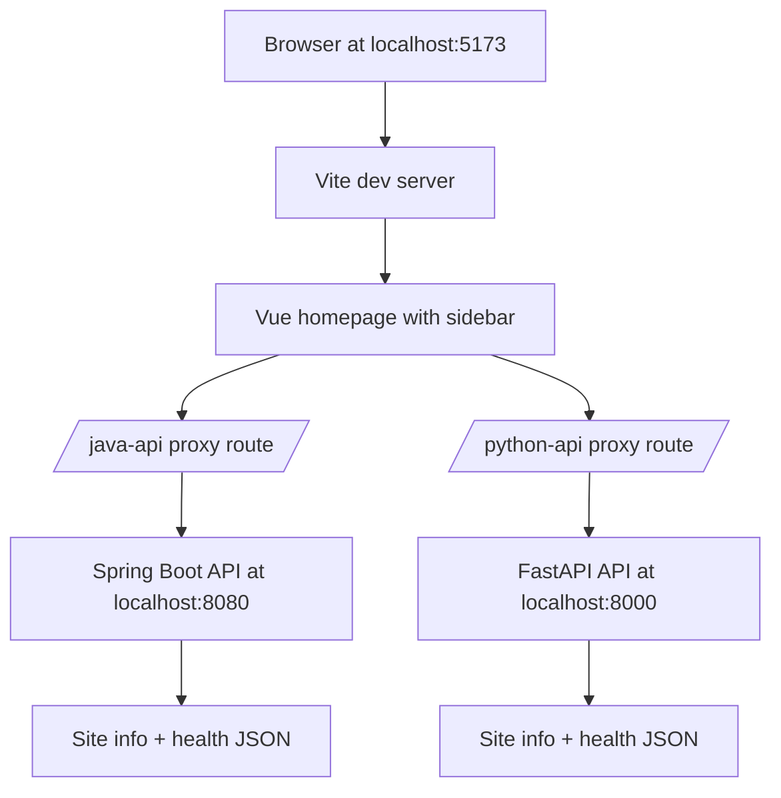

# feat: Create personal site three-service demo

## Summary

新建一个最小本地个人站点 demo，包含三个可独立启动的服务：Vue + Vite + UnoCSS 前端、Spring Boot Java API、FastAPI Python API。前端提供一个带左侧侧边栏的首页，并通过 Vite 本地代理调用两个后端。根目录启动说明覆盖依赖安装、版本检查、端口、健康检查和三服务联调方式。

---

## Problem Frame

当前目录为空，本次工作是绿地脚手架，不是改造已有项目。目标不是一次性做完整个人站点，而是先搭出一个能运行、能展示页面、能调用两个后端的基础骨架。后续菜单应该可以逐步添加，而不需要重新拆分服务边界。

---

## Requirements

**Workspace and startup**

- R1. 目录结构清晰区分一个前端应用和两个后端 API 服务。
- R2. 根目录启动说明面向 macOS，写明依赖安装、版本检查、端口、安装步骤、运行步骤和健康检查。
- R3. 首版启动方式以本地多终端运行为主，不引入 Docker Compose 或生产部署流程。

**Frontend**

- R4. 前端使用 Vue 3 + Vite + UnoCSS，提供一个首页和一个为后续菜单预留的左侧侧边栏。
- R5. 首页调用 Java 与 Python 两个后端，并分别展示加载、成功和失败状态。
- R6. 前端通过 Vite dev proxy 调用后端，首版不要求两个后端配置 CORS。

**Backends**

- R7. Java 后端是 Spring Boot API 服务，暴露站点信息接口和健康检查接口。
- R8. Java 后端遵循 controller 调用 service 的边界，并返回一个小型统一响应包装。
- R9. Python 后端是 FastAPI API 服务，接口形状与 Java 后端保持一致。

**Verification**

- R10. 每个有功能行为的服务都有一组小测试验证初始契约。
- R11. 三个服务本地同时运行后，前端可以展示两个后端的成功响应。

---

## Key Technical Decisions

- KTD1. **目录采用 `apps/` 和 `services/`：** `apps/frontend` 放浏览器应用，`services/java-api` 与 `services/python-api` 放两个后端服务。这个结构直接对应三服务模型，同时避免过早引入 monorepo 工具。
- KTD2. **前端首版使用 Vue SFC JavaScript：** demo 应优先保持小而易读；当菜单数据、接口契约或共享模型变复杂时，再迁移 TypeScript。
- KTD3. **Vite proxy 负责本地 API 路由：** 前端调用 `/java-api/...` 和 `/python-api/...` 这类稳定路径，`vite.config.js` 再转发到后端端口。这样后端首版不需要处理 CORS。
- KTD4. **Spring Boot 使用 Maven wrapper 语义：** Java 服务应尽量不依赖全局 Maven，但启动说明仍需检查 JDK 和 Maven wrapper 可用性。
- KTD5. **Python 使用 FastAPI + uv：** FastAPI 适合最小 typed HTTP API，uv 符合 Python 项目优先工作流，并能管理虚拟环境和依赖。
- KTD6. **端口固定：** 前端使用 `5173`，Java API 使用 `8080`，Python API 使用 `8000`，让启动说明和代理配置可预测。
- KTD7. **首版不包含数据库、鉴权或部署层：** 本次只验证页面、接口调用和本地启动；持久化、登录、Docker Compose、CI 和生产托管全部后置。

---

## High-Level Technical Design



本地开发时，浏览器只访问 Vite dev server。Vite 将 API 请求转发到两个后端端口，Vue 首页把两个后端视为独立服务状态来源。

---

## Output Structure

```text
.
|-- README.md
|-- apps/
|   `-- frontend/
|       |-- index.html
|       |-- package.json
|       |-- uno.config.js
|       |-- vite.config.js
|       `-- src/
|           |-- App.vue
|           |-- App.spec.js
|           |-- api/
|           |   `-- services.js
|           |-- components/
|           |   |-- ServiceStatusCard.vue
|           |   `-- Sidebar.vue
|           `-- main.js
`-- services/
    |-- java-api/
    |   |-- pom.xml
    |   `-- src/
    |       |-- main/
    |       |   |-- java/com/example/personalsite/
    |       |   |   |-- PersonalSiteApplication.java
    |       |   |   |-- common/ApiResponse.java
    |       |   |   |-- controller/SiteController.java
    |       |   |   |-- dto/SiteInfoResponse.java
    |       |   |   `-- service/
    |       |   |       |-- SiteInfoService.java
    |       |   |       `-- impl/SiteInfoServiceImpl.java
    |       |   `-- resources/application.yml
    |       `-- test/java/com/example/personalsite/controller/SiteControllerTest.java
    `-- python-api/
        |-- .python-version
        |-- pyproject.toml
        |-- app/
        |   |-- __init__.py
        |   |-- main.py
        |   `-- schemas.py
        `-- tests/test_site.py
```

如果实现时生成器额外创建 wrapper 或配置文件，可以接受文件列表有小幅变化，但三服务边界应保持不变。

---

## Implementation Units

### U1. Workspace skeleton and conventions

- **Goal:** 建立三服务目录骨架和顶层约定。
- **Requirements:** R1, R3
- **Dependencies:** None
- **Files:** `README.md`, `apps/frontend/`, `services/java-api/`, `services/python-api/`
- **Approach:** 创建目录结构，不引入 workspace 管理器。根目录只放启动文档和可选共享忽略规则；服务自己的构建工具和配置保留在服务目录内。
- **Patterns to follow:** 遵循用户全局规范：前端用 Vue 3 Composition API，Java 使用 controller 到 service 的分层边界，Python 优先 uv 而不是 pip。
- **Test scenarios:** Test expectation: none -- 本单元只建立目录和文档占位。
- **Verification:** 从根目录就能识别前端、Java API、Python API 的位置，不需要阅读生成代码。

### U2. Vue + Vite + UnoCSS frontend shell

- **Goal:** 构建带左侧侧边栏和两个后端服务状态卡片的首页。
- **Requirements:** R4, R5, R6, R10, R11
- **Dependencies:** U1
- **Files:** `apps/frontend/package.json`, `apps/frontend/index.html`, `apps/frontend/vite.config.js`, `apps/frontend/uno.config.js`, `apps/frontend/src/main.js`, `apps/frontend/src/App.vue`, `apps/frontend/src/components/Sidebar.vue`, `apps/frontend/src/components/ServiceStatusCard.vue`, `apps/frontend/src/api/services.js`, `apps/frontend/src/App.spec.js`
- **Approach:** 使用 Vite Vue 模板形状，在 Vite 中注册 UnoCSS，并在入口导入 `virtual:uno.css`。配置 Java 与 Python 的 Vite dev proxy。侧边栏菜单用本地小数组表达，后续新增菜单时只改局部数据。
- **Patterns to follow:** Vue SFC 使用 `<script setup>`，组件保持小而可复用，API helper 与组件渲染分离。不要引入 Element Plus，因为用户指定了 UnoCSS，且首屏不需要组件库。
- **Test scenarios:**
  - Happy path: mock 的 Java 与 Python API 都返回成功 JSON 时，首页显示两个健康状态卡片。
  - Edge case: 侧边栏只有一个占位菜单项时，不依赖 router 也能正常渲染。
  - Error path: 一个后端调用失败时，对应卡片显示失败状态，另一个卡片仍显示成功状态。
  - Loading path: API 调用完成前，状态卡片显示加载状态，不展示过期的成功文案。
- **Verification:** 前端可以在 `5173` 端口启动，显示个人站点首页，并通过代理路径获取两个后端状态。

### U3. Spring Boot Java API service

- **Goal:** 创建 Java 后端，提供最小分层 API 契约。
- **Requirements:** R7, R8, R10, R11
- **Dependencies:** U1
- **Files:** `services/java-api/pom.xml`, `services/java-api/src/main/java/com/example/personalsite/PersonalSiteApplication.java`, `services/java-api/src/main/java/com/example/personalsite/common/ApiResponse.java`, `services/java-api/src/main/java/com/example/personalsite/controller/SiteController.java`, `services/java-api/src/main/java/com/example/personalsite/dto/SiteInfoResponse.java`, `services/java-api/src/main/java/com/example/personalsite/service/SiteInfoService.java`, `services/java-api/src/main/java/com/example/personalsite/service/impl/SiteInfoServiceImpl.java`, `services/java-api/src/main/resources/application.yml`, `services/java-api/src/test/java/com/example/personalsite/controller/SiteControllerTest.java`
- **Approach:** 只使用 Spring Web 与 Spring Boot Test。Controller 返回 `ApiResponse<SiteInfoResponse>`，并把 payload 组装委托给 `SiteInfoService`；在没有外部调用或持久化前，不创建 integration 或 dal 包。
- **Execution note:** 先补 controller 契约测试，再扩展接口字段，因为这个服务的主要价值是被前端消费的 API 契约。
- **Patterns to follow:** Java public 类和 public 方法补 Javadoc。启动和接口访问日志使用 SLF4J，禁止 `System.out`。
- **Test scenarios:**
  - Happy path: `GET /api/site` 返回 HTTP 成功、统一响应包装和标识 Java 服务的 payload。
  - Happy path: `GET /api/health` 返回可供 README 健康检查使用的健康状态。
  - Contract path: controller 委托 `SiteInfoService`，而不是在 controller 内直接组装全部数据。
  - Serialization path: 响应字段名与前端 API helper 预期一致。
- **Verification:** Java API 在 `8080` 端口启动，站点信息接口返回 JSON，测试不依赖数据库或外部服务即可通过。

### U4. FastAPI Python API service

- **Goal:** 创建 Python 后端，使其与 Java 服务提供一致的站点信息和健康检查契约。
- **Requirements:** R9, R10, R11
- **Dependencies:** U1
- **Files:** `services/python-api/pyproject.toml`, `services/python-api/.python-version`, `services/python-api/app/__init__.py`, `services/python-api/app/main.py`, `services/python-api/app/schemas.py`, `services/python-api/tests/test_site.py`
- **Approach:** 使用 uv 管理 application 项目，并安装 FastAPI standard 依赖。用小型 Pydantic response model 明确响应形状，使其接近 Java 后端响应。
- **Execution note:** 先用 FastAPI `TestClient` 覆盖两个端点，再填充实现。
- **Patterns to follow:** 首版把路由注册保留在 `app/main.py`，只把 schema 提取到 `app/schemas.py`；在 Python 侧出现真实业务逻辑前，不增加额外 service 抽象。
- **Test scenarios:**
  - Happy path: `GET /api/site` 返回 HTTP 成功，并包含标识 Python 服务的 payload。
  - Happy path: `GET /api/health` 返回可供 README 健康检查使用的健康状态。
  - Contract path: 返回 JSON 使用与 Java API 一致的顶层包装形状。
  - Docs path: 服务暴露 FastAPI 生成的 API docs，同时保留显式 API 端点。
- **Verification:** Python API 在 `8000` 端口启动，两个端点都能响应，测试在 uv 管理环境内通过。

### U5. Startup and verification documentation

- **Goal:** 让开发者从空目录或新 checkout 按根目录说明启动项目。
- **Requirements:** R2, R3, R11
- **Dependencies:** U2, U3, U4
- **Files:** `README.md`
- **Approach:** 文档先写 macOS Intel + Homebrew 的依赖安装建议，再列出 Node、pnpm、Java、Maven wrapper、uv、Python 的版本检查。分别写前端、Java API、Python API 的安装和运行方式，最后给出三个本地地址的联调检查。
- **Patterns to follow:** 文档以任务为导向，命令要足够准确可执行；排障只覆盖常见版本不匹配和端口占用。
- **Test scenarios:** Test expectation: none -- 本单元为文档，验证方式是按文档启动。
- **Verification:** 开发者按 `README.md` 能打开 `5173` 前端、`8080` Java API、`8000` Python API，并在首页看到两个后端卡片成功。

---

## Acceptance Examples

- AE1. Given 三个服务都已运行, when 用户打开前端首页, then 左侧侧边栏可见，两个后端状态卡片都显示成功响应。
- AE2. Given Python API 停止且 Java API 正常运行, when 用户打开前端首页, then Java 卡片成功，Python 卡片显示失败状态，页面不崩溃。
- AE3. Given 一台干净的 macOS 开发机, when 用户按启动说明操作, then 缺失的 Node、pnpm、Java、uv 或 Python 前置条件会在启动服务前暴露。

---

## Scope Boundaries

- 首版只包含一个首页；真实内容页和菜单路由后续再加。
- 首版只返回本地静态响应；不包含数据库、DAL、Redis、MQ 或持久化层。
- 首版不包含认证、授权、个人资料编辑或后台管理 UI。
- 首版不包含 Docker Compose、CI workflow、生产构建流水线或公网部署目标。

### Deferred to Follow-Up Work

- 当第二个真实菜单页面出现时再引入 Vue Router。
- 只有在本地多服务启动跑通且出现明确部署或 onboarding 需求后，再增加 Docker Compose。
- 只有当前后端契约漂移开始造成维护成本时，再考虑共享 API schema 或代码生成。

---

## System-Wide Impact

本计划会创建仓库的初始形状，因此目录结构和端口选择会成为后续扩展的默认基线。前端代理路径是本地开发契约；未来部署时需要决定保留网关路径，还是改为按环境注入 API base URL。

---

## Risks & Dependencies

- **Node compatibility:** 当前 Vite 与 Vue 文档要求 Node `^20.19.0 || >=22.12.0`，启动说明应把它作为硬性预检查。
- **Java compatibility:** 当前 Spring Boot 文档要求 Java 17+ 和 Maven 3.6.3+；实现应优先使用 Maven wrapper，但仍需要兼容 JDK。
- **Proxy assumptions:** Vite proxy 只解决本地开发路由，不是生产路由方案。
- **Port conflicts:** `5173`、`8080`、`8000` 都是常见默认端口，README 应写明端口被占用时如何处理。
- **Dependency freshness:** 实现时应使用执行当时脚手架生成的当前依赖版本，不在本计划中硬编码容易过期的补丁版本。

---

## Sources & Research

- [Vite Getting Started](https://vite.dev/guide/): Vite 文档说明 Vue 脚手架、默认 dev 端口 `5173`、CLI scripts 和当前 Node 要求。
- [Vue Quick Start](https://vuejs.org/guide/quick-start.html): Vue 文档说明 `create vue` 和基于 Vite 的 Vue 应用 Node 前置要求。
- [UnoCSS Vite Plugin](https://unocss.dev/integrations/vite): UnoCSS 文档说明安装 `unocss`、注册 Vite 插件、创建 `uno.config` 和导入 `virtual:uno.css`。
- [Spring Boot System Requirements](https://docs.spring.io/spring-boot/system-requirements.html): Spring Boot 4.1.0 文档说明 Java 17+ 兼容性和 Maven 3.6.3+ 构建支持。
- [Spring Boot Build Systems](https://docs.spring.io/spring-boot/reference/using/build-systems.html): Spring Boot 文档推荐使用 Maven 或 Gradle 管理依赖。
- [FastAPI documentation](https://fastapi.tiangolo.com/): FastAPI 文档说明 `fastapi[standard]`、`fastapi dev`、生成式 API docs 和包含 Uvicorn 的标准依赖集。
- [uv documentation](https://docs.astral.sh/uv/): uv 文档说明 Homebrew 安装、`uv init`、`.python-version`、`pyproject.toml` 和 `uv run` application 项目工作流。
