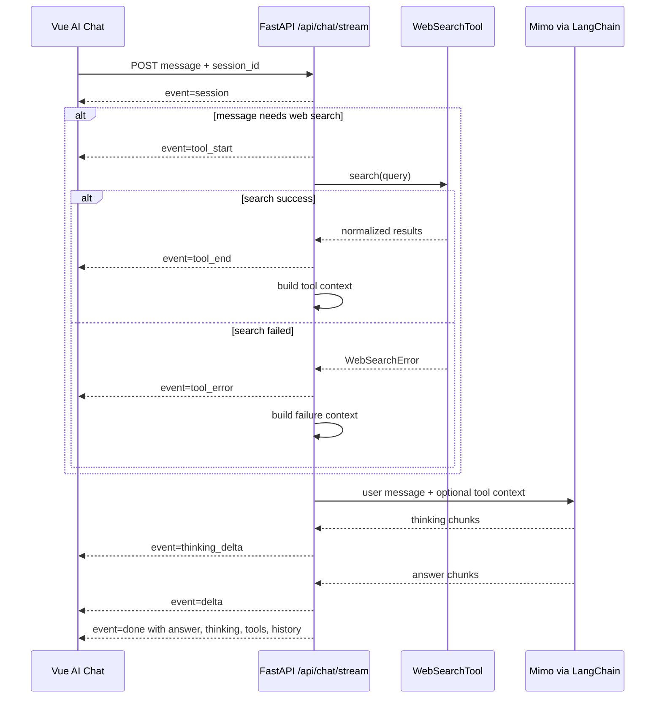

# feat: Add web search tool to AI chat

## Summary

为 Python AI 聊天服务规划一个 Web 搜索工具，并接入现有流式 AI 对话链路。目标是在用户问题明显需要联网信息时，后端先执行 Web 搜索，再把搜索结果作为上下文交给模型回答，同时在前端交互记录中展示工具调用入参、出参和失败原因。

本计划用于补充记录本次 Web 搜索工具改动。由于实现已先于计划落地，下方同时列出已发生的变更清单和应遵循的设计计划。

---

## Change List

### Python API

- `services/python-api/app/web_search.py`
  - 新增 Web 搜索工具模块。
  - 支持 `tavily`、`brave`、`serper` 三种 provider。
  - 使用标准库 `urllib` 发起 HTTP 请求，不新增 Python 依赖。
  - 将不同 provider 的响应规整为统一结构：`provider`、`query`、`results`。
  - 提供 `should_use_web_search`，按关键词判断是否触发搜索。
  - 提供 `build_web_search_context`，把搜索结果整理成模型上下文。

- `services/python-api/app/ai_chat.py`
  - 引入 `web_search_tool`。
  - 非流式聊天在调用模型前执行工具，并将工具结果注入模型上下文。
  - 流式聊天新增 `tool_start`、`tool_end`、`tool_error` SSE 事件。
  - `done` 事件中增加 `tools` 字段，保留本轮工具调用记录。

- `services/python-api/app/schemas.py`
  - 新增 `ToolCallRecord` 模型。
  - `ChatResponse` 新增可选 `tools` 字段。

- `services/python-api/app/main.py`
  - 更新流式接口注释，说明新增工具事件。

- `services/python-api/tests/test_site.py`
  - 增加 Web 搜索触发判断测试。
  - 增加搜索上下文格式化测试。
  - 更新流式 SSE 测试，覆盖 `tool_start`、`tool_end` 和 `tools`。

### Frontend

- `apps/frontend/src/api/services.js`
  - `streamChatMessage` 新增 `onTool` 回调。
  - SSE parser 支持 `tool_start`、`tool_end`、`tool_error`。

- `apps/frontend/src/components/AiChatPanel.vue`
  - 当前轮交互记录中保存 `tools`。
  - 右侧“交互记录”新增“工具调用”区块。
  - 展示工具名称、状态、入参、出参和错误信息。

- `apps/frontend/src/App.spec.js`
  - 更新 AI 聊天流式测试，覆盖 Web 搜索工具展示。

### Documentation

- `README.md`
  - 增加 Web 搜索工具配置说明。
  - 说明支持的 provider 和环境变量。

- `services/python-api/README.md`
  - 增加 Python API 本地启动时的搜索工具配置说明。

---

## Problem Frame

当前 AI 聊天已经支持：

- LangChain + Anthropic 兼容接口调用 Mimo 模型；
- session 级内存会话历史；
- SSE 流式输出正式回复；
- SSE 流式输出 thinking；
- 前端展示历史 session、当前对话和交互入参/出参。

缺口是：模型无法主动获取最新 Web 信息。用户问“最新版本”“新闻”“官网”“价格”等问题时，只靠模型已有知识容易过期。因此需要一个可控的 Web 搜索工具。

---

## Requirements

- R1. Web 搜索工具只放在 Python API 后端，前端不直接持有搜索 API token。
- R2. 首版不引入新依赖，避免增加 uv / pip 安装负担。
- R3. 搜索 provider 通过环境变量配置，至少支持一个主 provider，并允许后续替换。
- R4. 普通聊天不应依赖 Web 搜索；只有明确搜索意图时才触发。
- R5. 搜索成功时，搜索结果要注入模型上下文。
- R6. 搜索失败时，不中断整轮聊天；应把失败原因作为工具上下文交给模型，并在前端交互记录展示。
- R7. 流式接口要暴露工具调用过程，便于前端实时展示。
- R8. 前端交互记录要展示工具入参、出参和错误。
- R9. 测试覆盖工具触发、工具事件和前端展示。

---

## Key Technical Decisions

- KTD1. **首版用关键词触发工具：** 使用“搜索”“查一下”“联网”“最新”“新闻”“官网”“价格”等关键词判断是否需要 Web 搜索。这样行为可预测，避免所有问题都依赖外部 API。
- KTD2. **不使用模型 tool calling：** 当前 LangChain 链路仍是手动编排。后续如果要让模型自主选择工具，再引入 tool calling 或 agent executor。
- KTD3. **标准库 HTTP：** 用 `urllib` 调用搜索 API，减少依赖和安装问题。
- KTD4. **provider 可替换：** `WEB_SEARCH_PROVIDER` 支持 `tavily`、`brave`、`serper`，统一输出结构，前端不关心具体 provider。
- KTD5. **工具事件独立于模型 token：** SSE 新增 `tool_start`、`tool_end`、`tool_error`，不混入 `delta` 或 `thinking_delta`。
- KTD6. **工具记录归入当前轮交互：** 前端把工具记录放在右侧“交互记录”，主对话气泡仍只展示 thinking 和正式回复。

---

## High-Level Design



---

## Implementation Plan

### Step 1. Add Backend Tool Module

- 新增 `services/python-api/app/web_search.py`。
- 定义统一数据结构：
  - `WebSearchResult`
  - `WebSearchResponse`
  - `WebSearchError`
- 实现 provider 调用：
  - Tavily: `https://api.tavily.com/search`
  - Brave: `https://api.search.brave.com/res/v1/web/search`
  - Serper: `https://google.serper.dev/search`
- 实现配置读取：
  - `WEB_SEARCH_PROVIDER`
  - `WEB_SEARCH_MAX_RESULTS`
  - `TAVILY_API_KEY`
  - `BRAVE_SEARCH_API_KEY`
  - `SERPER_API_KEY`

### Step 2. Extend Chat Schema

- 新增 `ToolCallRecord`。
- `ChatResponse` 增加 `tools: list[ToolCallRecord] | None`。
- 保持 `tools` 可选，避免普通聊天响应膨胀。

### Step 3. Integrate Tool Into AI Chat

- 在 `AiChatService` 中新增工具调用编排。
- 非流式接口：
  - 先判断是否触发搜索；
  - 执行搜索；
  - 把搜索上下文传给模型；
  - 返回 `tools`。
- 流式接口：
  - 搜索开始前发送 `tool_start`；
  - 搜索成功发送 `tool_end`；
  - 搜索失败发送 `tool_error`；
  - 最终 `done` 返回 `tools`。

### Step 4. Update Frontend Streaming Parser

- `streamChatMessage` 新增 `onTool` 回调。
- SSE parser 增加：
  - `tool_start`
  - `tool_end`
  - `tool_error`

### Step 5. Update AI Chat UI

- 每轮 interaction 的 `response` 增加 `tools`。
- 新增工具状态合并逻辑：
  - `tool_start` 记录为 `running`；
  - `tool_end` 更新为 `success`；
  - `tool_error` 更新为 `error`。
- 右侧交互记录展示：
  - 工具名称；
  - 工具状态；
  - 工具入参；
  - 工具出参；
  - 错误信息。

### Step 6. Documentation and Tests

- README 增加搜索 provider 配置说明。
- Python tests 覆盖：
  - 搜索意图判断；
  - 搜索上下文格式化；
  - SSE 工具事件。
- Frontend tests 覆盖：
  - `tool_start` / `tool_end` 事件；
  - 工具调用区块展示。

---

## Config

Tavily:

```bash
export WEB_SEARCH_PROVIDER="tavily"
export WEB_SEARCH_MAX_RESULTS="5"
export TAVILY_API_KEY="your Tavily key"
```

Brave:

```bash
export WEB_SEARCH_PROVIDER="brave"
export BRAVE_SEARCH_API_KEY="your Brave Search key"
```

Serper:

```bash
export WEB_SEARCH_PROVIDER="serper"
export SERPER_API_KEY="your Serper key"
```

---

## Verification Plan

- Python:

```bash
cd services/python-api
.venv/bin/python -m pytest
.venv/bin/python -m compileall app tests
```

- Frontend:

```bash
cd apps/frontend
env PATH=/Users/liushan/.nvm/versions/node/v24.13.0/bin:$PATH ./node_modules/.bin/vitest run
env PATH=/Users/liushan/.nvm/versions/node/v24.13.0/bin:$PATH ./node_modules/.bin/vite build
```

- Java:

```bash
cd services/java-api
env JAVA_HOME=/Library/Java/JavaVirtualMachines/jdk-21.jdk/Contents/Home PATH=/Library/Java/JavaVirtualMachines/jdk-21.jdk/Contents/Home/bin:$PATH /Users/liushan/.sdkman/candidates/maven/3.6.3/bin/mvn test
```

---

## Rollback Plan

如果需要撤销 Web 搜索工具改动，按以下顺序回滚：

- 删除 `services/python-api/app/web_search.py`。
- 从 `services/python-api/app/ai_chat.py` 移除：
  - `web_search_tool` 相关 import；
  - `_call_tools`；
  - `tool_start` / `tool_end` / `tool_error` 事件；
  - tool context 注入逻辑；
  - `done.tools` 字段。
- 从 `services/python-api/app/schemas.py` 移除：
  - `ToolCallRecord`；
  - `ChatResponse.tools`。
- 从前端移除：
  - `services.js` 的 `onTool` 回调和工具事件 parser；
  - `AiChatPanel.vue` 中的工具状态维护和工具调用展示区块。
- 回退测试和 README 中的搜索工具内容。

---

## Open Questions

- Q1. 是否继续使用关键词触发，还是改成模型自主 tool calling？
- Q2. 默认 provider 是否固定为 Tavily，还是让本地配置必须显式指定？
- Q3. 搜索结果是否需要在主对话回复中强制带引用链接？
- Q4. 后续是否需要把工具调用记录持久化到数据库？
